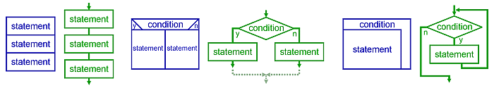

# OOP Is Bad, Actually?
> The biggest problem in the development and maintenance of large-scale software systems is complexity — large systems are hard to understand. 
## Approaches to Understanding
There are two widely-used approaches to understanding systems (or components of systems):
+ Testing: This is attempting to understand a system from the outside — as a “black box”. Conclusions about the system are drawn on the basis
of observations about how it behaves in certain specific situations.
Testing may be performed either by human or by machine. The former
is more common for whole-system testing, the latter more common for
individual component testing.
+ Informal Reasoning: This is attempting to understand the system by examining it from the inside. The hope is that by using the extra information available, a more accurate understanding can be gained.

Dijkstra observed [Dij71, EWD303]:
>“testing is hopelessly inadequate....(it) can be used very e↵ectively to show the presence of bugs but never to show their absence.”

## Causes of Complexity
> We believe that the major contributor to this complexity in many systems is the handling of state and the burden that this adds when trying to analyse and reason about the system. (Out of the Tar Pit - Ben Moseley, Peter Marks)

## What is OOP?
### Before OOP
https://en.wikipedia.org/wiki/Programming_paradigm#History

#### Procedural programming
Procedural call.

#### Structural programming
> Structured programming is a programming paradigm aimed at improving the clarity, quality, and development time of a computer program by making extensive use of the structured control flow constructs of selection (if/then/else) and repetition (while and for), block structures, and subroutines. (Wikipedia)

#### Modular Programming
https://en.wikipedia.org/wiki/Modular_programming

### What makes OOP different from other ways of programming?
+ Encapsulation: Data and behaviors
+ Association (and not )
  + Mostly one-to-one and one-to-many (hierarchial)
  + Awkward in many-to-many relationship: https://www.alachisoft.com/resources/articles/m-n-relationships.html

C modules do encapsulate data and behaviors, but does not have association relationship.

C structs have association relationships, but does not normally encapsulate data and behaviors.

Inheritance is not required in all flavors of OOP.

Polymorphism is not unique to OOP.

### Four Pillars
https://levelup.gitconnected.com/oop-concepts-simplified-8b0a9f7384ba

## Decomposing Principles

## Reference
[Edsger Dijkstra: The Humble Programmer](https://www.cs.utexas.edu/users/EWD/ewd03xx/EWD340.PDF)

[Structured programming - Wikipedia](https://en.wikipedia.org/wiki/Structured_programming)

[Go To Statement Considered Harmful](https://dl.acm.org/doi/pdf/10.1145/362929.362947)

[Object-Oriented Programming is Bad - Brian Will - Youtube](https://www.youtube.com/watch?app=desktop&v=QM1iUe6IofM)

[Object-Oriented Programming: A Disaster Story](https://medium.com/@brianwill/object-oriented-programming-a-personal-disaster-1b044c2383ab)

[Cohesion and Coupling in Software with Examples](https://thevaluable.dev/cohesion-coupling-guide-examples/)

[Global Variables and States: Why So Much Hate?](https://thevaluable.dev/global-variable-explained/)

[Execution in the Kingdom of Nouns](http://steve-yegge.blogspot.com/2006/03/execution-in-kingdom-of-nouns.html)

[Object-Oriented Programming — The Trillion Dollar Disaster](https://www.notion.so/Object-Oriented-Programming-The-Trillion-Dollar-Disaster-by-Ilya-Suzdalnitski-Better-Programmi-050820cdc59b445398c9fe4f24016172)
