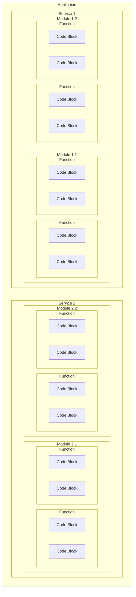

# What is software decomposition

> Structured analysis breaks down a software system from the system context level to system functions and data entities as described by Tom DeMarco. (Wikipedia)

> Object-oriented decomposition, on the other hand, breaks a large system down into progressively smaller classes or objects that are responsible for some part of the problem domain. (Wikipedia)

An application can be thought of, logically, as containing data (states) and logic. And an application can be decomposed along these dimensions.

> In terms of logic, there is a spectrum from code -> block -> function -> package -> service. 

> In hierarchical data model, there is a spectrum from one piece of primitive data -> array/map/struct -> complex composite -> package -> service. In relational data model, there is a spectrum from row -> table -> database -> database server.



> In terms of design quality, there is a spectrum from code quality -> design quality -> architecture quality.

The design quality of an application can basically be determined from the design quality of each parts and the degree of coupling between these top-level parts.

- The quality of decomposition is determined by two factors: cohesion and coupling.
- The degree of coupling in the system is one of the primary indicators of the quality of the decomposition. The other indicators include cohesion, and obviously the quality of the different parts (e.g. if you choose MongoDB as your no-sql databases).

## Logic can be decomposed into blocks

```C
// C Blocks
// Static variables representing account balances
static double balance1 = 200.0;
static double balance2 = 300.0;

void bankSimulation(double withdrawalAmount, double depositAmount) {
    // Withdrawal operation from balance1
    {
        if (balance1 >= withdrawalAmount) {
            balance1 -= withdrawalAmount;
            printf("Withdrawn $%.2f from Account 1\n", withdrawalAmount);
        } else {
            printf("Insufficient funds for withdrawal from Account 1.\n");
        }
    }

    // Deposit operation into balance2
    {
        balance2 += depositAmount;
        printf("Deposited $%.2f into Account 2\n", depositAmount);
    }
}
```

```kotlin
// Kotlin Scope Functions
val hexNumberRegex = run {
    val digits = "0-9"
    val hexDigits = "A-Fa-f"
    val sign = "+-"

    Regex("[$sign]?[$digits$hexDigits]+")
}

for (match in hexNumberRegex.findAll("+123 -FFFF !%*& 88 XYZ")) {
    println(match.value)
}
```

```go
// Golang Blocks
v := "outer"
fmt.Println(v)
{
    v := "inner"
    fmt.Println(v)
    {
        fmt.Println(v)
    }
}
{
    fmt.Println(v)
}
fmt.Println(v)
```

## Logic can be decomposed into functions

```C
#include <stdio.h>

// Function to calculate sum of an array of numbers
int calculateSum(int numbers[], int n) {
    int sum = 0;
    for (int i = 0; i < n; i++) {
        sum += numbers[i];
    }
    return sum;
}

// Function to find maximum of an array of numbers
int findMax(int numbers[], int n) {
    int max = numbers[0];
    for (int i = 1; i < n; i++) {
        if (numbers[i] > max) {
            max = numbers[i];
        }
    }
    return max;
}

// Function to find minimum of an array of numbers
int findMin(int numbers[], int n) {
    int min = numbers[0];
    for (int i = 1; i < n; i++) {
        if (numbers[i] < min) {
            min = numbers[i];
        }
    }
    return min;
}

int main() {
    int n;
    printf("Enter the number of elements: ");
    scanf("%d", &n);

    int numbers[n];
    printf("Enter %d numbers:\n", n);
    for (int i = 0; i < n; i++) {
        scanf("%d", &numbers[i]);
    }

    // Calculate sum
    int sum = calculateSum(numbers, n);

    // Find maximum
    int max = findMax(numbers, n);

    // Find minimum
    int min = findMin(numbers, n);

    // Display results
    printf("Sum: %d\n", sum);
    printf("Average: %.2lf\n", average);
    printf("Maximum: %d\n", max);
    printf("Minimum: %d\n", min);

    return 0;
}
```

## Data can be decomposed into data structures: array, map, struct, table, composite

```C
// C array
const int CITY = 5;
const int WEEK = 7;
int temperature[CITY][WEEK];
```

```kotlin
// Kotlin map (associative array)
val scores = mapOf(
    "Alice" to 95,
    "Bob" to 87,
    "Charlie" to 91
)
```

```java
// Java Stack
Stack<Integer> stack = new Stack<>();
// Java Queue
Queue<Integer> queue = new LinkedList<>();
```

```C
// C struct
struct Student {
    char name[50];
    int age;
    char grade;
};
```

```kotlin
// Kotlin array of maps
val arrayOfMaps: Array<Map<String, Any>> = arrayOf(
    mapOf("name" to "Alice", "age" to 25, "grade" to 'A'),
    mapOf("name" to "Bob", "age" to 30, "grade" to 'B'),
    mapOf("name" to "Charlie", "age" to 28, "grade" to 'C')
)
```

```kotlin
// Kotlin maps of arrays
val map: Map<Array<Int>, Array<String>> = mapOf(
    arrayOf(1, 2, 3) to arrayOf("apple", "banana", "orange"),
    arrayOf(4, 5) to arrayOf("grape", "kiwi")
)
```

```kotlin
// Kotlin more complex data structure
data class Student(val name: String, val age: Int)
val students = arrayOf(
    mapOf(
        Student("Alice", 20) to mapOf("Math" to 85, "Physics" to 90)
    ),
    mapOf(
        Student("Bob", 22) to mapOf("History" to 75, "English" to 80)
    ),
    mapOf(
        Student("Charlie", 21) to mapOf("Biology" to 95, "Chemistry" to 88)
    )
)
```

```
import ballerina/io;

type Employee record {|
    readonly int id;
    string firstName;
    string lastName;
    int salary;
|};

public function main() {
    table<Employee> key(id) employees = table [
            {id: 1, firstName: "John", lastName: "Smith", salary: 100},
            {id: 2, firstName: "Jane", lastName: "Smith", salary: 150},
            {id: 4, firstName: "Fred", lastName: "Bloggs", salary: 200},
            {id: 7, firstName: "Bobby", lastName: "Clark", salary: 300},
            {id: 9, firstName: "Cassie", lastName: "Smith", salary: 250}
        ];

    int[] salaries = from var emp in employees
                     select emp.salary;
    io:println(salaries);

    table<Employee> highPaidEmployees = from Employee emp in employees
                             where emp.salary > 180
                             order by emp.firstName
                             select emp;

    foreach Employee emp in highPaidEmployees {
        io:println(emp.firstName, " ", emp.lastName);
    }
}
```

## Data and logic can be decomposed into object (OOP)

```java
// Java class
public class Student {
    private String name;
    private int age;
    private char grade;

    // Constructor
    public Student(String name, int age, char grade) {
        this.name = name;
        this.age = age;
        this.grade = grade;
    }

    // Getters and Setters
    public String getName() {
        return name;
    }

    public void setName(String name) {
        this.name = name;
    }

    public int getAge() {
        return age;
    }

    public void setAge(int age) {
        this.age = age;
    }

    public char getGrade() {
        return grade;
    }

    public void setGrade(char grade) {
        this.grade = grade;
    }

    // Method to check if student is eligible for promotion
    public boolean isEligibleForPromotion() {
        return grade >= 'C'; // Assuming grade 'C' or above is eligible
    }

    // Method to print a message based on the student's grade
    public void printGradeMessage() {
        switch (grade) {
            case 'A':
                System.out.println("Excellent performance!");
                break;
            case 'B':
                System.out.println("Good performance!");
                break;
            case 'C':
                System.out.println("Satisfactory performance.");
                break;
            default:
                System.out.println("Needs improvement.");
                break;
        }
    }

    // Override toString() method
    @Override
    public String toString() {
        return "Student{" +
                "name='" + name + '\'' +
                ", age=" + age +
                ", grade=" + grade +
                '}';
    }
}
```

## Data and logic can be decomposed into packages


## Packages can be decomposed into modules


## Persistent data can be divided into sql tables/no-sql documents


## Sql tables/no-sql documents can be separated into different databases


## Differences between decomposing data+logic into C modules vs. Java objects

Even though data+logic can be encapsulated using either modules in C or objects in Java, there are two critical differences.

One critical difference is that multiple similar objects in Java can be _instatiated_ from the same class (the blueprint specifying what fields and methods are included). 

The other crirical difference is the relationships between the parts. Java provides built-in constructs to manage the following relationships between objects. C does not provides built-in constructs to manage the relationships between modules, except dependency in the form of `#inlcude`.

| Relationship | C   | Java |
| ------------ | --- | ---- |
| Dependency   | yes | yes  |
| Association  | no  | yes  |
| Aggregation  | no  | yes  |
| Composition  | no  | yes  |
| Inheritance  | no  | yes  |

C modules basically function as packages in Java. Java `class` is closer to C `struct`. C `struct` supports Association, Aggregation and Composition. However, C `struct` does not support encapsulation of data and behavior in the Java sense. We can only approximate by adding field of function pointer to a `struct`. Then we can simulate the Dependency and Inheritance relationship.

```c
#include <stdio.h>
#include <stdlib.h>
#include <string.h>

// Forward declaration of the Person struct
struct Person;

// Function pointer type for printing a Person object
typedef void (*PrintFunc)(const struct Person*);

// Define a structure to represent a Person object
typedef struct Person {
    char name[50];
    int age;
    PrintFunc print;
} Person;

// Function to create a new Person object
Person* createPerson(const char* name, int age) {
    Person* person = (Person*)malloc(sizeof(Person));
    if (person == NULL) {
        fprintf(stderr, "Memory allocation failed\n");
        exit(EXIT_FAILURE);
    }
    strncpy(person->name, name, sizeof(person->name));
    person->age = age;
    person->print = printPerson; // Assigning the print function pointer
    return person;
}

// Function to destroy a Person object
void destroyPerson(Person* person) {
    if (person != NULL) {
        free(person);
    }
}

// Function to print information about a Person object
void printPerson(const Person* person) {
    if (person != NULL) {
        printf("Name: %s\n", person->name);
        printf("Age: %d\n", person->age);
    }
}

int main() {
    // Create a new Person object
    Person* person1 = createPerson("John Doe", 30);

    // Call the print function via the function pointer
    person1->print(person1);

    // Destroy the Person object
    destroyPerson(person1);

    return 0;
}
```